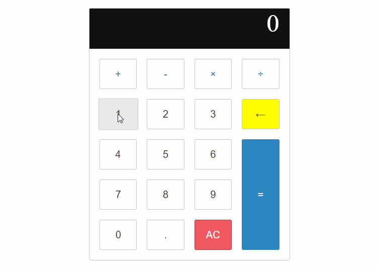

# Standard-Calculator-GUI
Standard Calculator Functionality: Implemented on web page
Resources: HTML, CSS, JavaScript, Visual Studio Code

📝 `NOTE:` Below is the App Walkthrough
### App Walk-through

- [x] Perform basic calculator operations
- [x] Implement a GUI for the calculator
- [x] Build in logic to show the solution when "=" is clicked
- [x] Push code to GitHub
